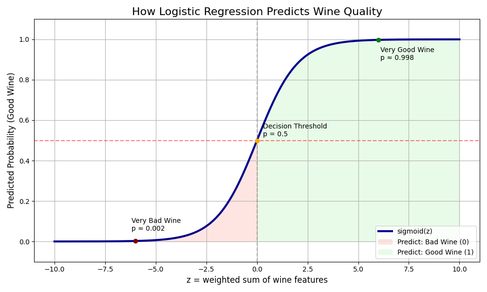

# CACI Data Derby 2 — Predicting 🍷 Quality 

Welcome to the **CACI Data Derby**! This project tackles the challenge of predicting wine quality using binary classification (`good` = 1, `bad` = 0) based on chemical and physical attributes.

At its core is the mathematics of **logistic regression**—a model that estimates probabilities using the **sigmoid function**:

\[
\hat{p}(x_i) = \frac{1}{1 + e^{-(\mathbf{w}^\top x_i + b)}}
\]

This smooth curve, centered on **Euler’s number \( e \)**, transforms any linear combination of features into a probability between 0 and 1, making it ideal for classifying good vs bad wine.

---

## 📁 Project Structure

```bash
.
├── data
│   ├── README.md                   # You are here!
│   ├── test.csv                    # Unlabeled wines for prediction
│   └── train.csv                   # Training data (1,120 labeled wines)
├── notebooks
│   └── starter-code.ipynb          # Provided jumpstart notebook
├── outputs
│   ├── figures
│   │   └── sigmoid_annotated.png
│   └── sample_submission.csv       # Submission format for Kaggle
└── src
    ├── __init__.py                 # Makes src a package
    ├── data_loader.py              # Load, validate, and prepare data
    ├── model.py                    # Core logistic regression logic
    ├── plot_sigmoid.py             # Enhanced sigmoid storytelling plots
    └── visualize.py                # (To be used for PCA/t-SNE, etc.)
```

##  Methodology

We will use a **logistic regression model**, fit to multiple predictor variables, with the aim of minimizing log-loss on the validation set. The output is interpreted as:

\[
\hat{p}(x_i) = \frac{1}{1 + e^{-(\mathbf{w}^\top x_i + b)}}
\]

The sigmoid function is centered on **Euler's number \( e \)**, transforming a linear combination of input features into a probability between 0 and 1. Wines are then classified as:

\[
\text{If } \hat{p}(x_i) \geq 0.5 \Rightarrow \text{Good Wine (1)}, \quad \text{else Bad Wine (0)}
\]

High-dimensional feature sets are visualized using:
- **Sigmoid surface plots** (for 2–3 predictors)
- **PCA or t-SNE projections** (for 3+ predictors)

---

### 📈 Sigmoid Curve: Visualizing the Decision

The plot below visualizes the sigmoid function used in logistic regression. As the weighted sum of wine features (e.g., alcohol, acidity, etc.) increases, the model predicts a higher probability that the wine is "good."

- The **red dashed line** marks the decision boundary at \( p = 0.5 \)
- The **shaded areas** show prediction regions:
  - 🍷 Left side → Bad wine (predict 0)
  - 🍷 Right side → Good wine (predict 1)
- The model smoothly transitions from uncertainty (center) to confidence (tails)



## Features

Each row in `train.csv` and `test.csv` represents a wine, described by various physico-chemical properties.

| Column                  | Description |
|-------------------------|-------------|
| `id`                    | Unique ID for each wine sample |
| `fixed_acidity`         | Tartaric acid concentration (g/dm³) |
| `volatile_acidity`      | Acetic acid concentration—too much can make wine taste vinegary |
| `citric_acid`           | Naturally present in grapes; adds freshness |
| `residual_sugar`        | Sugar remaining after fermentation (g/dm³) |
| `chlorides`             | Salt content in the wine |
| `free_sulfur_dioxide`   | SO₂ not bound to other molecules, acts as antimicrobial |
| `total_sulfur_dioxide`  | Total SO₂ content (bound + free) |
| `density`               | Density of the wine (g/cm³) |
| `pH`                    | Acidity level (lower pH = more acidic) |
| `sulphates`             | Added for microbial stability |
| `alcohol`               | Alcohol percentage (%) |
| `quality` *(train only)*| Wine quality score (binary: `1` = good, `0` = bad) |

**Note**: The `test.csv` file includes all features **except** `quality`, which must be predicted by the model.

### 🔍 Exploratory Data Analysis (EDA)

We begin with a quick EDA of `train.csv`:

- 13 total columns, 1120 rows
- No missing values
- Target variable: `quality` (binary 0/1)
- Slight class imbalance (54% good vs 46% bad wines)

We also normalize column names for cleaner scripting (e.g., `volatile_acidity`).

📸 Pairplot showing feature distributions and target split:


#### Key Insights:
`alcohol`
- Wines with higher alcohol content are more likely to be rated as good.
- This is the strongest individual predictor of wine quality.

`volatile_acidity`
- Good wines typically have lower volatile acidity.
- This inverse relationship is clean and visually distinguishable.

`sulphates`
- Higher sulphate concentrations slightly favor good wine classifications, though with more noise.

`citric_acid`
- A subtle trend suggests good wines have moderate to high citric acid levels.

`density`
- On its own, density doesn't separate the classes well — but may be useful in combination with other features.

#### Notable Feature Correlations:
- `free_sulfur_dioxide` is highly correlated with total_sulfur_dioxide
- `fixed_acidity` and `citric_acid` show positive correlation
- `residual_sugar` correlates with `density`

#### These correlations suggest we may benefit from:
- Dimensionality reduction techniques (e.g., PCA), or
- Regularization (e.g., L1/Lasso) to reduce redundant feature influence.